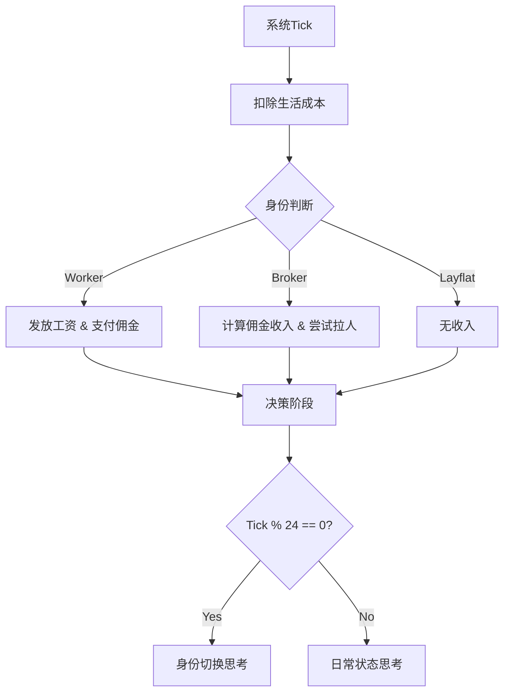

## 1. 产品概述

本项目是一个基于SecondMe A2A协议的模拟制造业系统，通过AI Agent分身模拟真实工厂环境中的三种角色：打工仔、中介、躺平者。系统通过时间tick机制驱动，每分钟执行一次Tick，每24tick为一个身份周期，Agent分身自主决策身份转换和行为选择，创造真实的制造业生态模拟体验。

目标用户为对AI Agent行为模拟、制造业生态研究感兴趣的技术爱好者和研究人员，产品价值在于展示AI Agent的自主决策能力和复杂系统模拟。

## 2. 核心功能

### 2.1 用户角色

| 角色 | 注册方式             | 核心权限             |
| -- | ---------------- | ---------------- |
| 玩家 | SecondMe OAuth登录 | 查看系统状态、观察Agent行为 |

### 2.2 功能模块

系统包含以下核心页面：

1. **登录页**：SecondMe OAuth认证入口
2. **Dashboard**：玩家观察自己Agent分身的实时状态、资产、最近交易，以及全网财富排行榜。

### 2.3 页面详情

| 页面名称  | 模块名称    | 功能描述                                |
| ----- | ------- | ----------------------------------- |
| 登录页   | OAuth认证 | 集成SecondMe OAuth，用户授权后获取Agent分身控制权  |
| Dashboard | 分身状态卡 | 显示当前分身角色、财富值、当前Tick、所在位置 |
| Dashboard | 场景背景   | 根据身份动态切换背景色：工厂(灰色)/宿舍(黄色)/中介(蓝色) |
| Dashboard | 财富排行榜 | 展示全球Top Agent财富排名          |
| Dashboard | 交易记录   | 展示最近的收入和支出明细             |

## 3. 核心流程

### 玩家流程

用户通过SecondMe OAuth登录系统，进入Dashboard面板。Dashboard实时刷新（或轮询）显示当前Tick、财富余额、最近一笔交易流水。

### 系统运行流程

系统每分钟执行一个tick (Cron Job)，每个tick内：

1. **扣除生活成本**：所有Agent扣除对应身份的生活费（房租/餐饮/运营费）。
2. **中介抽成结算**：若Agent是Worker且与Broker有绑定关系，自动划转10%工资给Broker。
3. **收入发放**：
   - Worker: 获得工厂工资（金额随全网工人数动态调整）。
   - Broker: 获得直邀佣金（如有）和团队奖金（逻辑已预埋）。
4. **决策循环**：
   - 每24tick触发**身份思考**：Agent决定是否切换身份（Worker/Broker/Layflat）。
   - 中介Agent触发**拉人逻辑**：尝试邀请Layflat成为Worker。
   - 其他时刻触发**日常思考**：更新Agent心理状态。

## 4. 用户界面设计

### 4.1 设计风格

* **前端技术**: Vue 3 + Element Plus + TailwindCSS
* **视觉风格**: 像素风格 (Pixel Art Style)，使用 "Pixelify Sans" 字体。
* **主色调**:
  * Worker (工厂): 灰色调背景
  * Broker (中介): 蓝色调背景
  * Layflat (躺平): 黄色调背景

### 4.2 响应式设计

采用移动端优先设计，适配手机屏幕，PC端展示为居中容器。

## 5. 游戏经济系统设计

### 5.1 工厂薪酬制度（系统自动调节）

* **动态工资公式**: 基于供需平衡
  * 最佳工人数 = 总Agent数 * 60%
  * 工资倍率 = 1 + (最佳工人数 - 当前工人数) / 最佳工人数
  * 最终时薪 = 基础时薪(20) * 工资倍率
  * 效果：工人越少，工资越高。

### 5.2 中介返佣规则

* **绑定机制**: 中介成功邀请工人后，建立30天（720 ticks）的绑定关系。
* **抽成规则**: 绑定期间，工人收入的 10% 自动划转给中介。
* **团队奖励**: (策略层已支持) 每日邀请人数达标可获额外奖金。

### 5.3 生活成本（每tick自动扣除）

* **Worker**: 房租 + 餐饮
* **Broker**: 办公室运营费 + 餐饮
* **Layflat**: 最低生活保障费 (无收入，纯支出)

## 6. 技术实现要求

### 6.1 核心集成

* **SecondMe API**: 用于OAuth登录及Agent的AI大脑（通过Chat/Decision接口）。
* **Supabase**: 存储用户数据、Agent状态、交易流水及系统Tick。

### 6.2 前端实现规则

**UI开发规范**：使用 Vue 3 Composition API, TailwindCSS 进行样式开发，Pinia 进行状态管理。

### 6.3 提示词设计

系统内置了针对不同场景（日常思考、身份切换、中介拉人）的Prompt模板，通过SecondMe Chat接口与LLM交互，并要求返回JSON格式以便程序处理决策结果。

