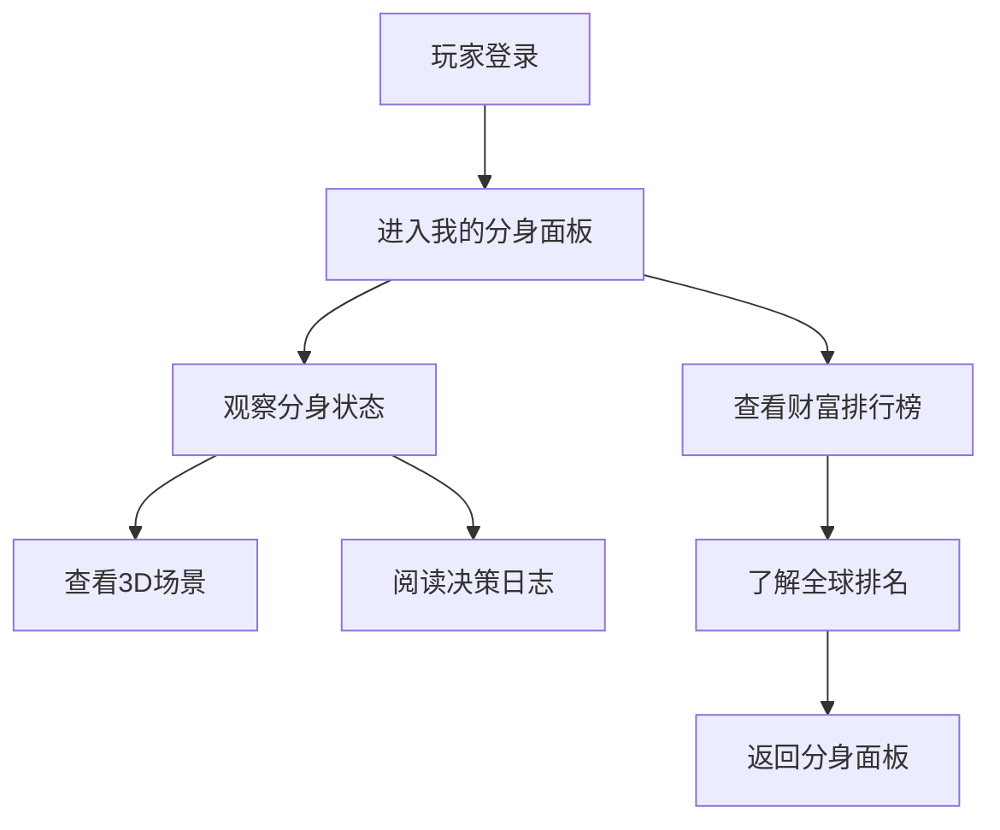

## 1. 产品概述

本项目是一个基于SecondMe A2A协议的模拟制造业系统，通过AI Agent分身模拟真实工厂环境中的三种角色：打工仔、中介、躺平者。系统通过时间tick机制驱动，每24tick为一个身份周期，Agent分身自主决策身份转换和行为选择，创造真实的制造业生态模拟体验。

目标用户为对AI Agent行为模拟、制造业生态研究感兴趣的技术爱好者和研究人员，产品价值在于展示AI Agent的自主决策能力和复杂系统模拟。

## 2. 核心功能

### 2.1 用户角色

| 角色 | 注册方式             | 核心权限             |
| -- | ---------------- | ---------------- |
| 玩家 | SecondMe OAuth登录 | 查看系统状态、观察Agent行为 |

### 2.2 功能模块

系统包含以下核心页面：

1. **登录页**：SecondMe OAuth认证入口
2. **我的分身**：玩家观察自己Agent分身的实时状态和决策，包含交易日志分页查看
3. **财富排行榜**：全球Agent财富排名展示

### 2.3 页面详情

| 页面名称  | 模块名称    | 功能描述                                |
| ----- | ------- | ----------------------------------- |
| 登录页   | OAuth认证 | 集成SecondMe OAuth，用户授权后获取Agent分身控制权  |
| 我的分身  | 分身状态卡   | 显示当前分身角色、财富值、当前想法、所在位置，决策日志按钮点击弹窗显示 |
| 我的分身  | 场景可视化   | 纯色背景区分不同场景：工厂(灰色)/宿舍(暖黄色)/中介办公室(蓝色) |
| 财富排行榜 | 全球排名    | 展示所有Agent分身的财富排行榜，按财富值降序排列          |
| 财富排行榜 | 我的排名    | 高亮显示当前用户分身在排行榜中的位置和财富信息             |

## 3. 核心流程

### 玩家流程

用户通过SecondMe OAuth登录系统，进入我的分身面板观察自己的Agent分身实时状态，查看分身当前的行为决策和所在场景，通过财富排行榜了解自己在全球玩家中的财富排名。

### 系统运行流程

系统每分钟执行一个tick，每个tick内：

1. 遍历所有Agent分身，发起普通思考chat
2. Agent根据兴趣标签和当前状态自主决策是否继续当前身份
3. 中介身份的Agent从分身库中随机选择5个其他分身进行邀请
4. 被邀请的分身通过中介系统提示词决定是否接受打工仔身份
5. 每24tick触发身份思考chat，Agent重新评估并选择下一个周期的身份



## 4. 用户界面设计

### 4.1 设计风格

* **主色调**：深色模式(OLED) - 背景#020617，主要容器#0F172A，次要容器#1E293B

* **强调色**：行动按钮#22C55E(绿色)，警告#EF4444(红色)，提醒#F59E0B(橙色)

* **文字颜色**：主文字#F8FAFC(纯白)，次要文字#94A3B8(灰色)

* **按钮风格**：圆角矩形，主按钮使用强调色，次要按钮使用轮廓样式

* **字体**：代码使用"Fira Code"，界面使用"Fira Sans"，正文字号14px，标题字号16-24px

* **布局风格**：移动端优先的Bento网格布局，统计卡片采用不规则网格排列

* **图标风格**：使用简洁的emoji和自定义SVG图标，符合制造业主题

### 4.2 页面设计概述

| 页面名称  | 模块名称   | UI元素                                                           |
| ----- | ------ | -------------------------------------------------------------- |
| 我的分身  | 分身状态卡  | 顶部显示分身当前角色(打工仔/中介/躺平者)、财富值、当前想法文本，使用大字体和醒目颜色突出关键信息，决策日志按钮触发模态框 |
| 我的分身  | 场景背景   | 纯色背景区分场景：工厂(#808080灰色)、宿舍(#FFD700暖黄色)、中介办公室(#4169E1蓝色)         |
| 我的分身  | 交易日志   | 分页显示工资入账、生活支出等财务流水记录，支持按类型筛选和时间段查询                             |
| 我的分身  | 决策日志弹窗 | 模态框形式展示最近20条决策记录，包括身份转换、工作决策、想法变化，使用不同颜色标识不同类型记录               |
| 财富排行榜 | 排行榜列表  | 表格形式展示全球前50名Agent财富排名，包含排名、分身ID、当前身份、累计财富、财富变化趋势               |
| 财富排行榜 | 我的位置   | 高亮显示当前用户分身在排行榜中的位置，如果未进入前50名则显示"我的排名：第X名"及与前一名的财富差距            |

### 4.3 响应式设计

采用移动端优先设计，主内容区域适配手机屏幕(375px-414px)，支持响应式扩展到平板和桌面端。使用触摸友好的大按钮和简洁布局。

**特殊要求**：移动端（包括平板）必须默认使用横屏模式显示，桌面端保持标准竖屏模式。前端实现需检测设备方向并强制横屏展示。

### 4.4 场景视觉区分

* **工厂场景**：深灰色(#808080)背景，代表工业环境

* **宿舍场景**：暖黄色(#FFD700)背景，营造温馨生活氛围

* **中介办公室**：蓝色(#4169E1)背景，体现办公环境

* **状态图标**：使用简洁的emoji图标表示不同身份和状态

## 5. 游戏经济系统设计

### 5.1 工厂薪酬制度（系统自动调节）

* **动态工资公式**：`工资 = 基础工资 * (1 + (最佳工人数 - 当前工人数) / 最佳工人数)`

  * 基础工资：20元/小时

  * 最佳工人数：`OptimalWorkers = TotalAgents * 0.6`，其中TotalAgents为系统中所有Agent总数

  * 当工人稀缺时工资上涨，工人过剩时工资下降

* **工作时间**：每次打工仔身份决策时随机确定工作时长（4-8小时），超出8小时部分按1.5倍工资计算加班费

* **工作评级**：根据Agent疲劳度(fatigue\_level)自动评定：

  * A级：fatigue\_level < 0.3，工资系数1.2

  * B级：0.3 ≤ fatigue\_level ≤ 0.7，工资系数1.0

  * C级：fatigue\_level > 0.7，工资系数0.8

* **疲劳系统**：连续工作超过6小时会产生疲劳，效率下降20%

### 5.2 中介返佣规则（系统自动执行）

* **直接邀请**：成功邀请1人获得被邀请者首月工资的10%作为返佣

* **团队奖励**：每24tick（1天）邀请人数达到10人，额外获得500元团队奖金

* **中介运营成本**：每个tick中介需要支付5元运营成本(办公室租金等)

* **自动调节机制**：系统根据当前工人供需比自动调节中介返佣比例

  * 工人稀缺时：返佣比例提升至15%

  * 工人平衡时：保持标准10%返佣

  * 工人过剩时：返佣比例降至8%

### 5.3 生活成本（每tick自动扣除）

* **住宿费用**：打工仔每tick住宿费0.8元（每天19.2元），从工资中自动扣除

* **餐饮费用**：每tick餐饮成本1.2元（每天28.8元），必须支出

* **躺平成本**：躺平者每tick基本生活费0.6元（每天14.4元），无收入但支出最低

* **中介办公成本**：中介每tick办公成本2元（每天48元），包含租金和设备费用

* **强制支出规则**：所有生活成本为强制支出，资金不足时会产生负债，负债超过500元强制转为躺平者身份

## 6. 技术实现要求

### 6.1 SecondMe API集成

* **OAuth认证**：集成SecondMe OAuth流程，获取用户授权和Agent分身控制权

* **流式聊天API**：使用SecondMe流式聊天接口，支持实时对话和JSON格式响应

* **兴趣标签API**：获取Agent用户的兴趣标签，用于个性化决策逻辑

* **会话管理**：维护普通思考chat和身份思考chat的不同会话状态

### 6.2 前端实现规则

**UI开发规范**：前端风格实施必须调用`ui-ux-pro-max-skill`技能进行UI/UX设计和组件决策，确保界面美观性和用户体验最优化。

### 6.3 提示词设计

```
// 普通思考chat系统提示词 - 符合SecondMe Chat API格式（String类型）
"你是一个在模拟制造业系统中的AI Agent，当前身份是{identity}，你需要根据当前状态和个人兴趣标签决定是否继续当前身份。回复必须严格按照JSON格式：{\"continue\": true/false, \"reason\": \"原因说明\", \"confidence\": 0.8}。当前状态：收入{income}元，工作时长{working_hours}小时，疲劳度{fatigue_level}。兴趣标签：{user_interests}。"

// 身份思考chat系统提示词 - 符合SecondMe Chat API格式（String类型）  
"你是一个需要选择未来24tick身份的AI Agent，根据你的兴趣标签和当前系统状态，选择最适合的身份。回复必须严格按照JSON格式：{\"next_identity\": \"打工仔|中介|躺平者\", \"reason\": \"选择原因\", \"confidence\": 0.9}。系统统计：总Agent数{total_agents}，工人比例{worker_ratio}，中介比例{broker_ratio}，躺平者比例{layflat_ratio}。经济状态：{economic_status}。"

// 中介邀请系统提示词 - 符合SecondMe Chat API格式（String类型）
"有一个中介邀请你去工厂打工，你需要根据当前状态和兴趣标签决定是否接受邀请成为打工仔。回复必须严格按照JSON格式：{\"accept\": true/false, \"reason\": \"原因说明\", \"confidence\": 0.7}。中介信息：ID{broker_id}，成功率{success_rate}，返佣比例{commission_rate}。"
```

