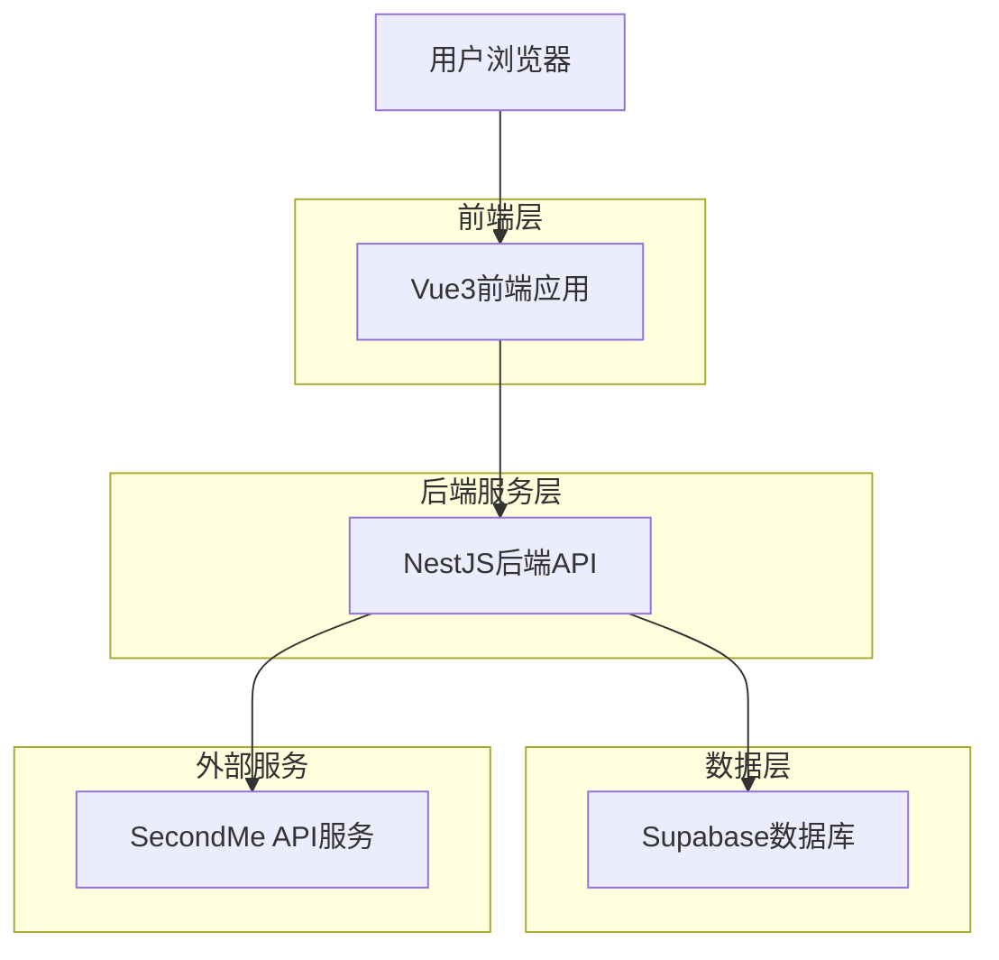
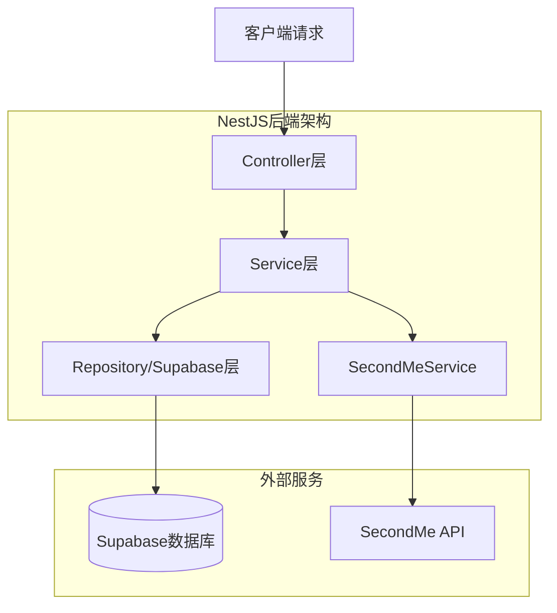
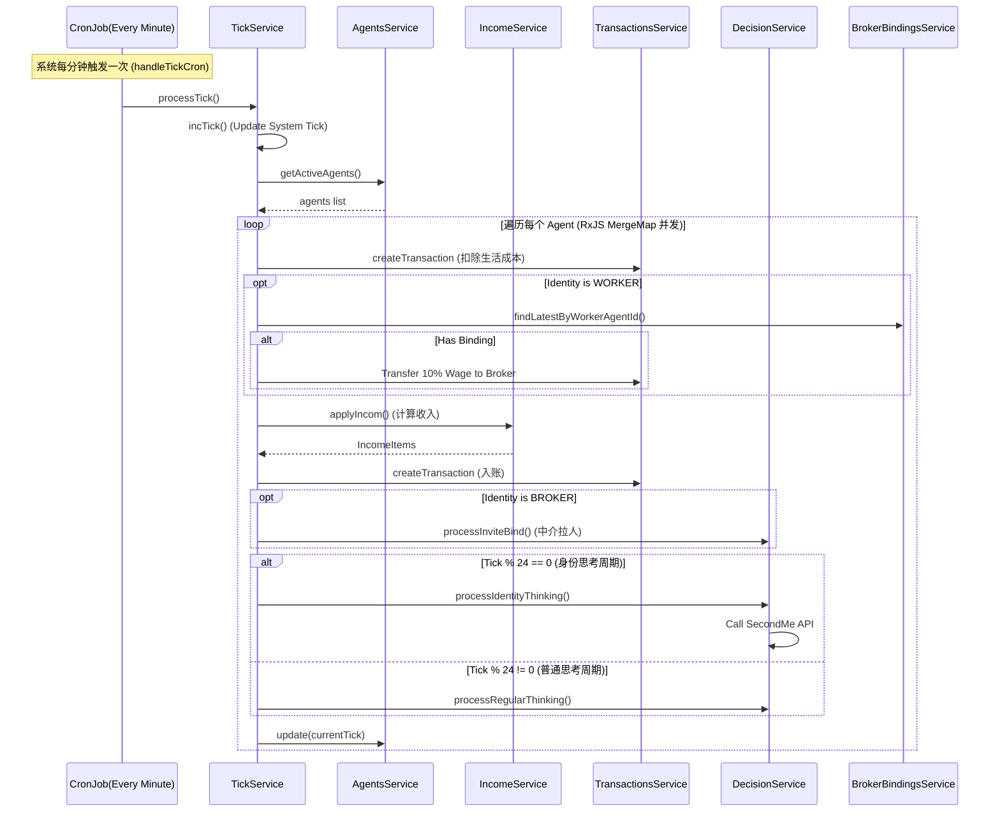
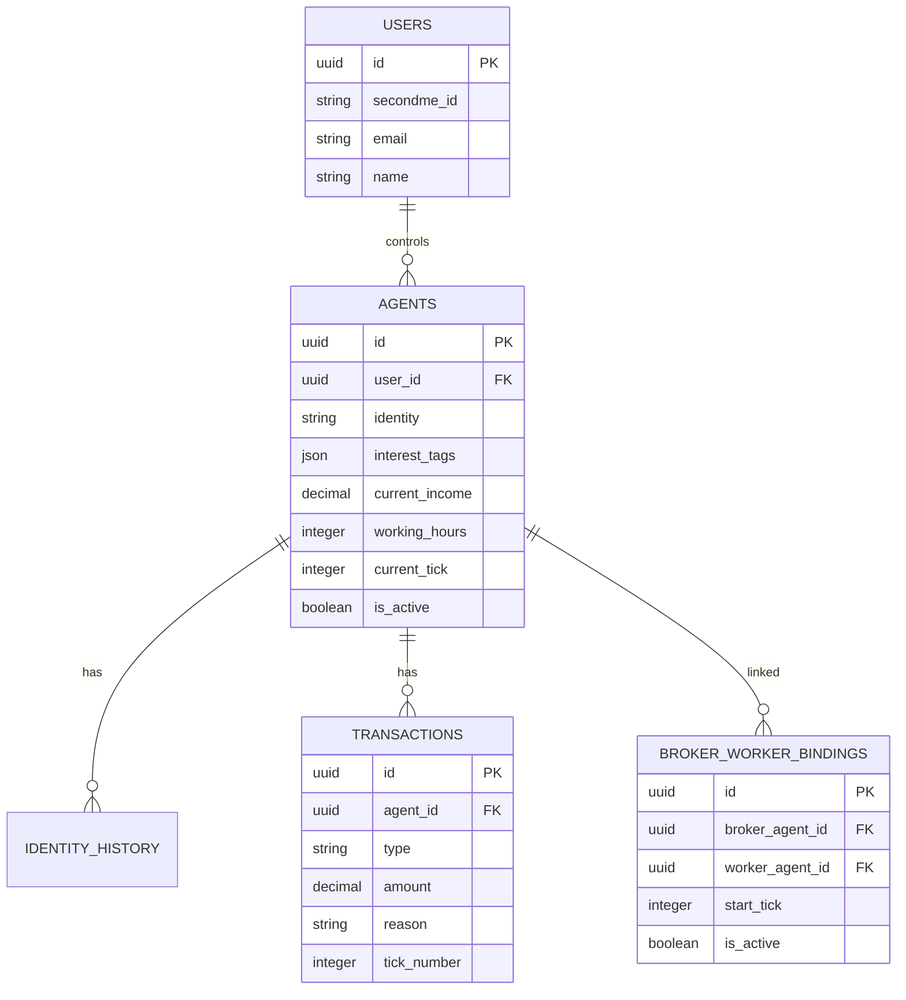

## 1. 架构设计



## 2. 技术描述

* **项目结构**: Monorepo 架构
  * 前端: 根目录 (Vue3 + Vite)
  * 后端: `/api` 目录 (NestJS)

* **前端**: Vue 3 + TypeScript + Vite @5.0
  * UI框架: Element Plus @2.13
  * 样式: TailwindCSS @3.4 + Sass
  * 状态管理: Pinia @3.0
  * 图标库: Lucide Vue Next

* **后端**: NestJS @10 + TypeScript
  * 调度任务: @nestjs/schedule (Cron)
  * 数据库客户端: @supabase/supabase-js
  * 响应式编程: RxJS (用于并发处理)

* **数据库**: Supabase (PostgreSQL)

* **部署**: Vercel

## 3. 前端路由定义

| 路由             | 用途                                          |
| -------------- | ------------------------------------------- |
| /              | 登录页，SecondMe OAuth认证                        |
| /dashboard     | 我的分身页，显示当前用户分身的实时状态。包含"排行榜"、"决策日志"、"账单"功能入口 |
| /auth/callback | OAuth回调处理页，处理授权码并跳转                         |

## 4. API定义

### 4.1 认证相关API

```
POST /api/auth/login
```

请求:

| 参数名   | 参数类型   | 是否必需 | 描述                |
| ----- | ------ | ---- | ----------------- |
| code  | string | 是    | SecondMe OAuth授权码 |
| state | string | 是    | OAuth状态参数         |

### 4.2 Agent相关API (AgentsController)

```
GET /api/agents/me
```

获取当前登录用户的Agent详情。

```
GET /api/agents/active
```

获取所有活跃Agent列表。

### 4.3 交易日志API (TransactionsController)

```
GET /api/transactions/me
```

请求参数:

| 参数名   | 参数类型   | 是否必需 | 描述                             |
| ----- | ------ | ---- | ------------------------------ |
| page  | number | 否    | 页码，默认1                         |
| limit | number | 否    | 每页数量，默认20                      |

### 4.4 系统与决策API

* **决策服务**: `DecisionService` 处理Agent的思考与身份转换。
* **聊天服务**: `ChatService` 负责与SecondMe API交互。



## 5. 核心业务交互时序



## 6. 数据模型

### 6.1 实体关系



### 6.2 关键表结构

**BrokerWorkerBinding表 (broker_worker_bindings)**

用于记录中介与工人的绑定关系，确立佣金流向。

```sql
CREATE TABLE broker_worker_bindings (
    id UUID PRIMARY KEY DEFAULT gen_random_uuid(),
    broker_agent_id UUID REFERENCES agents(id),
    worker_agent_id UUID REFERENCES agents(id),
    start_tick INTEGER,
    is_active BOOLEAN DEFAULT true,
    created_at TIMESTAMP WITH TIME ZONE DEFAULT NOW()
);
```

**System表 (system)**

单行表，用于维护全局Tick数。

```sql
CREATE TABLE system (
    tickNum INTEGER DEFAULT 0
);
```

## 7. 模块分层架构

### 7.1 核心模块 (Modules)

* **AppModule**: 根模块。
* **AuthModule**: 处理认证 (AuthService, AuthController)。
* **AgentsModule**: Agent管理 (AgentsService, AgentsController)。
* **TickModule**: 时间循环核心 (TickService)。
* **EconomyModule**: 经济模型 (EconomyService, IncomeService)。
* **DecisionModule**: AI决策 (DecisionService)。
* **TransactionsModule**: 交易流水 (TransactionsService)。
* **BrokerBindingsModule**: 中介绑定关系 (BrokerBindingsService)。
* **ChatModule**: 聊天功能 (ChatService)。
* **SecondmeModule**: SecondMe API集成 (SecondmeService)。
* **SupabaseModule**: 数据库客户端封装。

## 8. 关键服务实现

### 8.1 Tick服务 (TickService)

核心驱动引擎，使用 `@Cron(CronExpression.EVERY_MINUTE)` 触发。
主要职责：
1. 维护系统Tick自增。
2. 并发处理所有活跃Agent的生命周期。
3. 调用 `IncomeService` 计算收入。
4. 调用 `BrokerBindingsService` 处理佣金抽成（Worker -> Broker）。
5. 调度 `DecisionService` 进行AI决策（身份切换/日常思考/中介拉人）。

### 8.2 收入服务 (IncomeService)

封装经济策略：
* **工厂工资**: 基于 `calcWageMultiplier` (1 + (最佳 - 当前)/最佳) 动态计算。
* **中介佣金**: 基于 `classifyLaborMarket` (供需比) 确定佣金率 (虽目前TickService中使用固定10%进行转账，但策略层已支持动态)。

### 8.3 决策服务 (DecisionService)

* **processIdentityThinking**: 每24 Tick触发，通过SecondMe Chat API询问Agent是否切换身份。
* **processRegularThinking**: 非身份切换周期触发，更新Agent状态感受。
* **processInviteBind**: 中介身份触发，尝试邀请Layflat身份Agent成为Worker。

## 9. 部署配置

### 9.1 环境变量

```bash
# Supabase
SUPABASE_URL=...
SUPABASE_KEY=...

# SecondMe
SECONDME_CLIENT_ID=...
SECONDME_CLIENT_SECRET=...
SECONDME_REDIRECT_URI=...

# App
TICK_CONCURRENCY=4 # Tick处理并发数
```

### 9.2 Vercel配置

`vercel.json` 配置了路由重写，将 `/api/*` 转发至 NestJS 后端，其余请求服务于前端静态资源。
