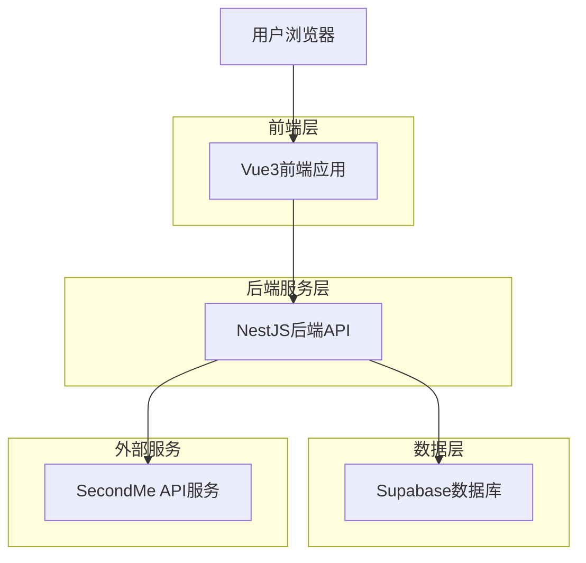
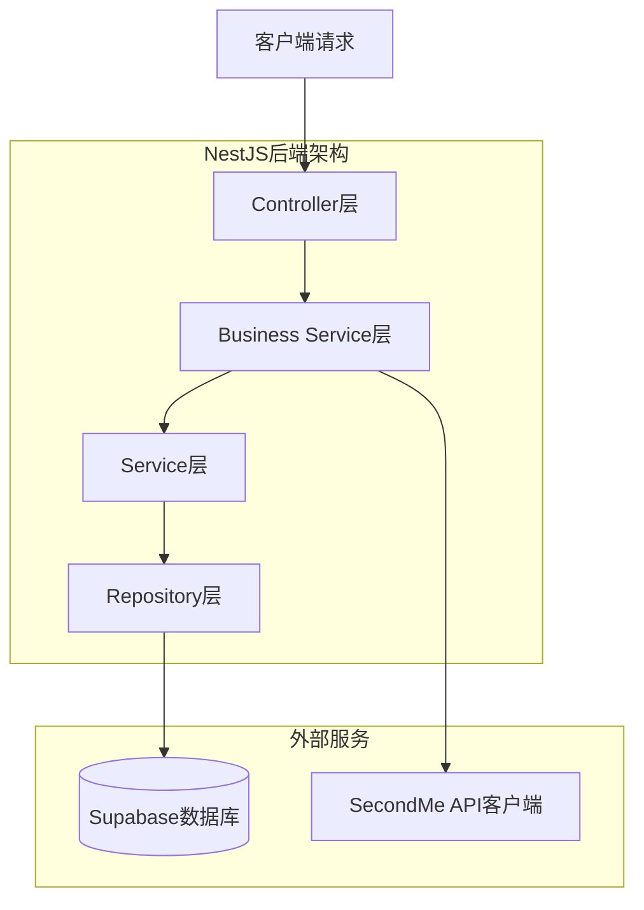
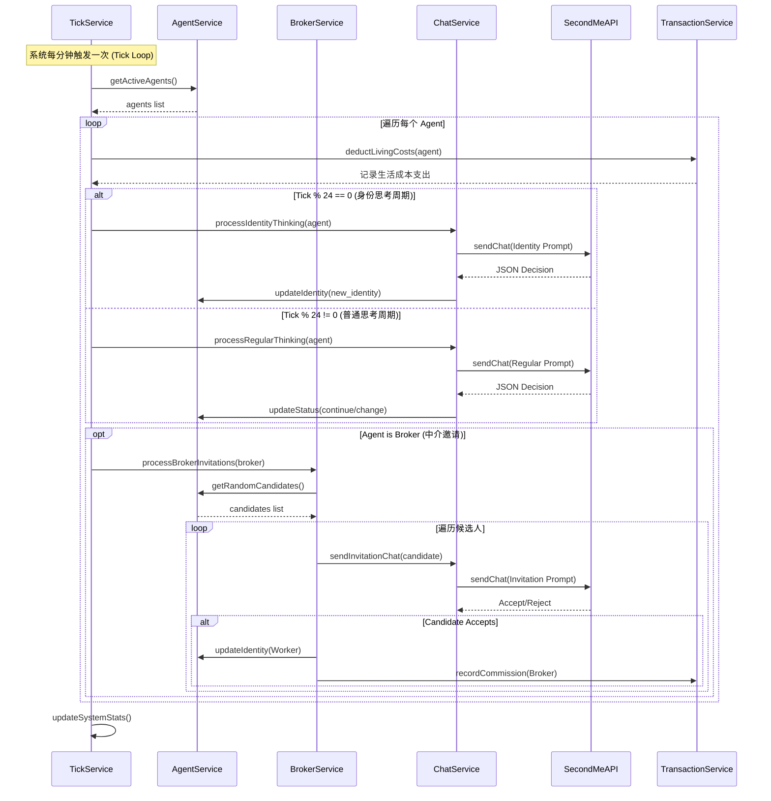
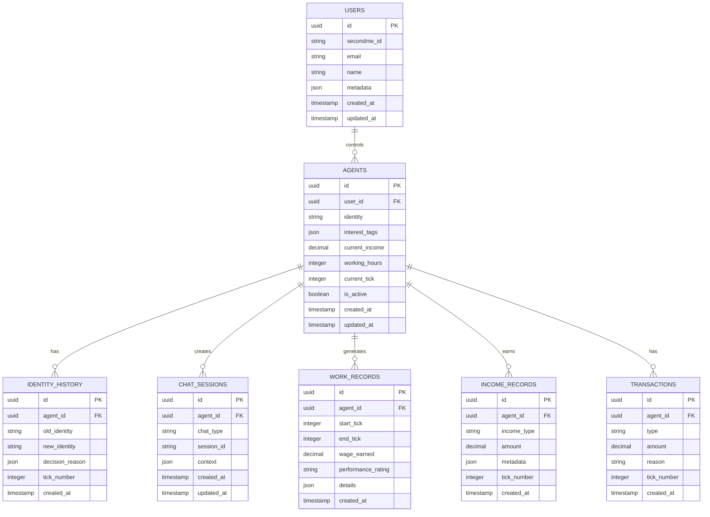

## 1. 架构设计



## 2. 技术描述

* **前端**: React\@18 + TailwindCSS\@3 + Vite\@5.0

* **初始化工具**: vite-init

* **后端**: NestJS\@10 + TypeScript\@5.3

* **数据库**: Supabase (PostgreSQL)

* **部署**: Vercel

* **测试框架**: Jest\@29 + Supertest\@6.3

## 3. 前端路由定义

| 路由             | 用途                                          |
| -------------- | ------------------------------------------- |
| /              | 登录页，SecondMe OAuth认证                        |
| /dashboard     | 我的分身页，显示当前用户分身的实时状态。包含"排行榜"、"决策日志"、"账单"功能入口 |
| /auth/callback | OAuth回调处理页，处理授权码并跳转                         |

## 4. API定义

### 4.1 认证相关API

```
POST /api/auth/login
```

请求:

| 参数名   | 参数类型   | 是否必需 | 描述                |
| ----- | ------ | ---- | ----------------- |
| code  | string | 是    | SecondMe OAuth授权码 |
| state | string | 是    | OAuth状态参数         |

### 4.2 当前Agent详情API

```
GET /api/agent/me
```

请求参数:

无 (通过Authorization Token获取当前用户身份)

响应:

| 参数名             | 参数类型   | 描述                            |
| --------------- | ------ | ----------------------------- |
| id              | string | Agent UUID                    |
| identity        | string | 当前身份: worker, broker, layflat |
| current\_income | number | 当前财富值                         |
| working\_hours  | number | 工作时长                          |
| current\_tick   | number | 当前Tick数                       |
| interest\_tags  | array  | 兴趣标签                          |
| user            | object | 关联的用户基本信息(头像/昵称)              |

### 4.3 交易日志API (账单)

```
GET /api/agents/me/transactions
```

请求参数:

| 参数名 | 参数类型 | 是否必需 | 描述 |
| --- | --- | --- | --- |
| page | number | 否 | 页码，默认1 |
| limit | number | 否 | 每页数量，默认20 |
| type | string | 否 | 交易类型：salary, commission, rent等 |

响应:

| 参数名          | 参数类型    | 描述     |
| ------------ | ------- | ------ |
| transactions | array   | 交易记录列表 |
| total        | number  | 总数     |
| page         | number  | 当前页码   |
| has\_next    | boolean | 是否有下一页 |

交易记录对象:

```json
{
  "id": "550e8400-e29b-41d4-a716-446655440000",
  "type": "salary",
  "amount": 160.00,
  "reason": "工厂工作8小时工资",
  "tick_number": 156,
  "created_at": "2024-01-15T10:30:00Z"
}
```

### 4.4 排行榜API

```
GET /api/agents/rank
```

请求参数:

| 参数名      | 参数类型   | 是否必需 | 描述                |
| -------- | ------ | ---- | ----------------- |
| page     | number | 否    | 页码，默认1            |
| limit    | number | 否    | 每页数量，默认20         |
| sort\_by | string | 否    | 排序字段: income (默认) |

响应:

| 参数名 | 参数类型 | 描述 |
| --- | --- | --- |
| agents | array | Agent列表 |
| me | object | 当前登录分身的排名信息 |
| total | number | 总数 |
| page | number | 当前页码 |

### 4.5 决策日志API

```
GET /api/agent/decisions
```

请求参数:

| 参数名 | 参数类型 | 是否必需 | 描述 |
| --- | --- | --- | --- |
| limit | number | 否 | 限制条数，默认20 |

响应:

| 参数名  | 参数类型  | 描述     |
| ---- | ----- | ------ |
| logs | array | 决策日志列表 |

决策日志对象:

```json
{
  "tick_number": 156,
  "type": "identity_switch",
  "content": "决定继续当打工仔，因为...",
  "details": { "old": "worker", "new": "worker" },
  "created_at": "2024-01-15T10:30:00Z"
}
```



## 5. 核心业务交互时序



## 6. 数据模型

### 6.1 数据模型定义



### 6.2 数据定义语言

用户表 (users)

```sql
-- 创建表
CREATE TABLE users (
    id UUID PRIMARY KEY DEFAULT gen_random_uuid(),
    secondme_id VARCHAR(255) UNIQUE NOT NULL,
    email VARCHAR(255) NOT NULL,
    name VARCHAR(100) NOT NULL,
    metadata JSONB DEFAULT '{}',
    created_at TIMESTAMP WITH TIME ZONE DEFAULT NOW(),
    updated_at TIMESTAMP WITH TIME ZONE DEFAULT NOW()
);

-- 创建索引
CREATE INDEX idx_users_secondme_id ON users(secondme_id);
CREATE INDEX idx_users_email ON users(email);
```

Agent表 (agents)

```sql
-- 创建表
CREATE TABLE agents (
    id UUID PRIMARY KEY DEFAULT gen_random_uuid(),
    user_id UUID REFERENCES users(id) ON DELETE CASCADE,
    identity VARCHAR(20) CHECK (identity IN ('worker', 'broker', 'layflat')),
    interest_tags JSONB DEFAULT '[]',
    current_income DECIMAL(10,2) DEFAULT 0,
    working_hours INTEGER DEFAULT 0,
    current_tick INTEGER DEFAULT 0,
    is_active BOOLEAN DEFAULT true,
    created_at TIMESTAMP WITH TIME ZONE DEFAULT NOW(),
    updated_at TIMESTAMP WITH TIME ZONE DEFAULT NOW()
);

-- 创建索引
CREATE INDEX idx_agents_user_id ON agents(user_id);
CREATE INDEX idx_agents_identity ON agents(identity);
CREATE INDEX idx_agents_is_active ON agents(is_active);
```

身份历史表 (identity\_history)

```sql
-- 创建表
CREATE TABLE identity_history (
    id UUID PRIMARY KEY DEFAULT gen_random_uuid(),
    agent_id UUID REFERENCES agents(id) ON DELETE CASCADE,
    old_identity VARCHAR(20),
    new_identity VARCHAR(20),
    decision_reason JSONB,
    tick_number INTEGER,
    created_at TIMESTAMP WITH TIME ZONE DEFAULT NOW()
);

-- 创建索引
CREATE INDEX idx_identity_history_agent_id ON identity_history(agent_id);
CREATE INDEX idx_identity_history_tick ON identity_history(tick_number);
```

收入记录表 (income\_records)

```sql
-- 创建表
CREATE TABLE income_records (
    id UUID PRIMARY KEY DEFAULT gen_random_uuid(),
    agent_id UUID REFERENCES agents(id) ON DELETE CASCADE,
    income_type VARCHAR(50) NOT NULL,
    amount DECIMAL(10,2) NOT NULL,
    metadata JSONB DEFAULT '{}',
    tick_number INTEGER,
    created_at TIMESTAMP WITH TIME ZONE DEFAULT NOW()
);

-- 创建索引
CREATE INDEX idx_income_records_agent_id ON income_records(agent_id);
CREATE INDEX idx_income_records_tick ON income_records(tick_number);
CREATE INDEX idx_income_records_type ON income_records(income_type);
```

交易流水表 (transactions)

```sql
-- 创建表
CREATE TABLE transactions (
    id UUID PRIMARY KEY DEFAULT gen_random_uuid(),
    agent_id UUID REFERENCES agents(id) ON DELETE CASCADE,
    type VARCHAR(50) NOT NULL CHECK (type IN ('salary', 'commission', 'rent', 'food', 'broker_cost', 'layflat_cost')),
    amount DECIMAL(10,2) NOT NULL,
    reason TEXT,
    tick_number INTEGER NOT NULL,
    created_at TIMESTAMP WITH TIME ZONE DEFAULT NOW()
);

-- 创建索引
CREATE INDEX idx_transactions_agent_id ON transactions(agent_id);
CREATE INDEX idx_transactions_type ON transactions(type);
CREATE INDEX idx_transactions_tick ON transactions(tick_number);
CREATE INDEX idx_transactions_created_at ON transactions(created_at DESC);
```

## 7. 模块分层架构

### 7.1 SVC层模块

* **auth-svc**: 认证服务，处理SecondMe OAuth流程

* **agent-svc**: Agent基础服务，管理Agent生命周期

* **chat-svc**: 聊天服务，处理与SecondMe的API交互

* **tick-svc**: 时间tick服务，管理系统时间循环，1分钟=1tick

* **economy-svc**: 经济系统服务，处理收入计算和规则

* **factory-svc**: 工厂服务，处理工作相关逻辑

* **factory-auto-balance-svc**: 工厂自动平衡服务，根据工人供需动态调节工资和返佣比例

* **transaction-svc**: 交易日志服务，处理财务流水记录和分页查询

* **game-loop-svc**: 游戏循环服务，协调tick逻辑和Agent决策流程

* **agent-decision-svc**: Agent决策服务，封装AI调用逻辑和响应解析

### 7.2 BIZ层模块

* **auth-biz**: 认证业务模块，包含登录、回调等控制器

* **agent-biz**: Agent业务模块，管理Agent状态和查询

* **system-biz**: 系统控制模块，处理tick控制和系统状态

## 8. 关键服务实现

### 8.1 Tick服务核心逻辑

```typescript
// tick-svc.service.ts
export class TickService {
  async processTick(tickNumber: number): Promise<void> {
    const agents = await this.agentService.getActiveAgents();
    
    for (const agent of agents) {
      if (tickNumber % 24 === 0) {
        // 身份思考chat
        await this.processIdentityChat(agent, tickNumber);
      } else {
        // 普通思考chat
        await this.processRegularChat(agent, tickNumber);
      }
    }
    
    // 更新系统tick
    await this.updateSystemTick(tickNumber);
  }
  
  private async processRegularChat(agent: Agent, tickNumber: number): Promise<void> {
    const chatContext = this.buildRegularChatContext(agent);
    const response = await this.chatService.sendChat(agent.id, chatContext);
    
    if (this.isValidJsonResponse(response)) {
      await this.handleAgentDecision(agent, response, tickNumber);
    }
  }
}
```

### 8.2 中介邀请逻辑

```typescript
// broker-svc.service.ts
export class BrokerService {
  async processBrokerInvitations(brokerId: string, tickNumber: number): Promise<void> {
    const candidates = await this.getRandomCandidates(brokerId, 5);
    
    for (const candidate of candidates) {
      const invitationContext = this.buildInvitationContext(brokerId, candidate);
      const response = await this.chatService.sendChat(candidate.id, invitationContext);
      
      if (this.isValidJsonResponse(response) && response.accept) {
        await this.convertToWorker(candidate, brokerId);
      }
    }
  }
  
  private async convertToWorker(agent: Agent, brokerId: string): Promise<void> {
    await this.agentService.updateIdentity(agent.id, 'worker');
    await this.recordBrokerCommission(brokerId, agent.id);
  }
}
```

### 8.3 交易日志服务

```typescript
// transaction-svc.service.ts
export class TransactionService {
  async recordTransaction(
    agentId: string, 
    type: TransactionType, 
    amount: number, 
    reason: string,
    tickNumber: number
  ): Promise<Transaction> {
    const transaction = await this.transactionRepository.create({
      agent_id: agentId,
      type,
      amount,
      reason,
      tick_number: tickNumber
    });
    
    // 更新Agent当前财富值
    await this.agentService.updateCurrentIncome(agentId, amount);
    
    return transaction;
  }
  
  async getAgentTransactions(
    agentId: string, 
    filters: TransactionFilters,
    pagination: PaginationParams
  ): Promise<PaginatedResult<Transaction>> {
    return await this.transactionRepository.findByAgentId(agentId, filters, pagination);
  }
  
  async getTransactionSummary(agentId: string, tickRange: number): Promise<TransactionSummary> {
    const transactions = await this.transactionRepository.findRecentByAgentId(agentId, tickRange);
    
    return {
      totalIncome: transactions.filter(t => t.amount > 0).reduce((sum, t) => sum + t.amount, 0),
      totalExpense: transactions.filter(t => t.amount < 0).reduce((sum, t) => sum + Math.abs(t.amount), 0),
      transactionCount: transactions.length,
      averageDailyFlow: this.calculateAverageDailyFlow(transactions)
    };
  }
}
```

### 8.4 游戏循环服务

```typescript
// game-loop-svc.service.ts
export class GameLoopService {
  private currentTick: number = 0;
  private tickInterval: NodeJS.Timeout;
  
  async startGameLoop(): Promise<void> {
    // 每分钟执行一次tick (1分钟 = 1tick)
    this.tickInterval = setInterval(async () => {
      await this.processTick(this.currentTick);
      this.currentTick++;
    }, 60000); // 60秒
  }
  
  private async processTick(tickNumber: number): Promise<void> {
    console.log(`Processing tick ${tickNumber}`);
    
    // 获取所有活跃Agent
    const agents = await this.agentService.getActiveAgents();
    
    // 处理每个Agent的tick逻辑
    for (const agent of agents) {
      try {
        // 扣除生活成本
        await this.deductLivingCosts(agent, tickNumber);
        
        // 处理身份特定逻辑
        await this.processIdentitySpecificLogic(agent, tickNumber);
        
        // 每24tick进行身份思考
        if (tickNumber % 24 === 0) {
          await this.agentDecisionService.processIdentityThinking(agent, tickNumber);
        } else {
          await this.agentDecisionService.processRegularThinking(agent, tickNumber);
        }
        
      } catch (error) {
        console.error(`Error processing agent ${agent.id} in tick ${tickNumber}:`, error);
      }
    }
    
    // 更新系统状态
    await this.updateSystemStats(tickNumber);
  }
  
  private async deductLivingCosts(agent: Agent, tickNumber: number): Promise<void> {
    const costs = this.getIdentityLivingCosts(agent.identity);
    
    for (const [costType, amount] of Object.entries(costs)) {
      await this.transactionService.recordTransaction(
        agent.id,
        costType as TransactionType,
        -amount,
        `${this.getCostReason(costType)} - Tick ${tickNumber}`,
        tickNumber
      );
    }
  }
}
```

### 8.5 Agent决策服务

```typescript
// agent-decision-svc.service.ts
export class AgentDecisionService {
  async processRegularThinking(agent: Agent, tickNumber: number): Promise<void> {
    const prompt = this.buildRegularThinkingPrompt(agent);
    const response = await this.secondMeApi.sendChat(agent.id, prompt);
    
    if (this.isValidJsonResponse(response)) {
      await this.handleRegularDecision(agent, response, tickNumber);
    }
  }
  
  async processIdentityThinking(agent: Agent, tickNumber: number): Promise<void> {
    const systemStats = await this.getSystemStats();
    const prompt = this.buildIdentityThinkingPrompt(agent, systemStats);
    const response = await this.secondMeApi.sendChat(agent.id, prompt);
    
    if (this.isValidJsonResponse(response)) {
      await this.handleIdentityDecision(agent, response, tickNumber);
    }
  }
  
  private buildRegularThinkingPrompt(agent: Agent): string {
    return `你是一个在模拟制造业系统中的AI Agent，当前身份是${agent.identity}，收入${agent.current_income}元，工作时长${agent.working_hours}小时，疲劳度${agent.fatigue_level}。兴趣标签：${agent.interest_tags.join(',')}。你需要根据当前状态决定是否继续当前身份。回复必须严格按照JSON格式：{"continue": true/false, "reason": "原因说明", "confidence": 0.8}`;
  }
  
  private buildIdentityThinkingPrompt(agent: Agent, stats: SystemStats): string {
    return `你是一个需要选择未来24tick身份的AI Agent，当前系统统计：总Agent数${stats.total_agents}，工人比例${stats.worker_ratio}，中介比例${stats.broker_ratio}，躺平者比例${stats.layflat_ratio}。根据你的兴趣标签${agent.interest_tags.join(',')}和系统状态，选择最适合的身份。回复必须严格按照JSON格式：{"next_identity": "打工仔|中介|躺平者", "reason": "选择原因", "confidence": 0.9}`;
  }
}
```

## 9. 单元测试要求

### 9.1 认证模块测试

```typescript
// auth.service.spec.ts
describe('AuthService', () => {
  describe('secondmeOAuth', () => {
    it('should handle successful oauth flow', async () => {
      const result = await authService.handleOAuthCallback('valid_code', 'state');
      expect(result.access_token).toBeDefined();
      expect(result.user).toBeDefined();
    });
    
    it('should handle invalid oauth code', async () => {
      await expect(authService.handleOAuthCallback('invalid_code', 'state'))
        .rejects.toThrow('Invalid authorization code');
    });
  });
});
```

### 9.2 Tick服务测试

```typescript
// tick.service.spec.ts
describe('TickService', () => {
  it('should process identity chat every 24 ticks', async () => {
    const agent = await createTestAgent('broker');
    await tickService.processTick(24);
    
    expect(chatService.sendChat).toHaveBeenCalledWith(
      agent.id,
      expect.objectContaining({
        chat_type: 'identity_thinking'
      })
    );
  });
  
  it('should handle invalid json response gracefully', async () => {
    const agent = await createTestAgent('worker');
    chatService.sendChat.mockResolvedValue('invalid json');
    
    await expect(tickService.processTick(1)).resolves.not.toThrow();
    expect(agent.identity).toBe('worker'); // 保持原状态
  });
});
```

## 10. 部署配置

### 10.1 Vercel配置

```json
{
  "version": 2,
  "builds": [
    {
      "src": "package.json",
      "use": "@vercel/node"
    }
  ],
  "routes": [
    {
      "src": "/api/(.*)",
      "dest": "/api/$1"
    },
    {
      "src": "/(.*)",
      "dest": "/index.html"
    }
  ],
  "env": {
    "SUPABASE_URL": "@supabase_url",
    "SUPABASE_KEY": "@supabase_key",
    "SECONDME_CLIENT_ID": "@secondme_client_id",
    "SECONDME_CLIENT_SECRET": "@secondme_client_secret",

  }
}
```

### 10.2 环境变量配置

```bash
# 数据库配置
SUPABASE_URL=https://your-project.supabase.co
SUPABASE_KEY=your-anon-key
SUPABASE_SERVICE_KEY=your-service-key

# SecondMe API配置
SECONDME_API_URL=https://api.secondme.io
SECONDME_CLIENT_ID=your-client-id
SECONDME_CLIENT_SECRET=your-client-secret
SECONDME_REDIRECT_URI=https://your-app.vercel.app/api/auth/callback

# 应用配置
NODE_ENV=production
PORT=3000
JWT_SECRET=your-j
```

