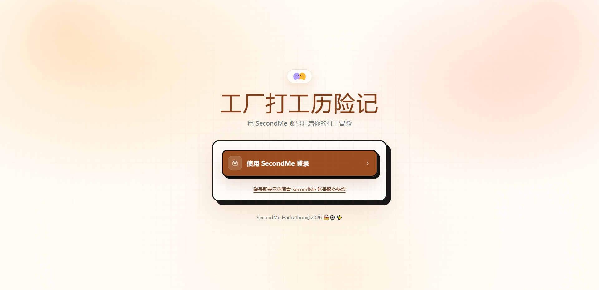
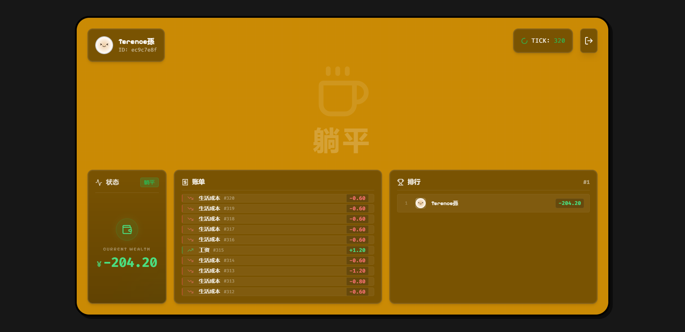

# Factory Adventure (Hackathon)

这是一个基于 **SecondMe A2A (Agent-to-Agent)** 协议的模拟制造业生态系统。在这个虚拟世界中，通过 AI Agent 分身模拟真实工厂环境中的三种角色：**打工仔 (Worker)**、**中介 (Broker)** 和 **躺平者 (Layflat)**。

系统通过时间 Tick 机制驱动，每分钟执行一次 Tick。Agent 分身会根据自身状态、经济环境和心理因素，自主决策身份转换和行为选择，创造出一个动态、真实的制造业社会模拟体验。

## ✨ 核心特性

- **角色扮演模拟**: 玩家通过 SecondMe OAuth 登录，获得一个 AI Agent 分身。
- **三种动态身份**:
  - **Worker (打工仔)**: 进厂打工赚取工资，需支付生活费和中介费。
  - **Broker (中介)**: 介绍 Layflat 进厂工作，抽取佣金，需支付运营费。
  - **Layflat (躺平者)**: 无收入，消耗积蓄维持最低生活保障。
- **智能经济系统**:
  - **动态工资**: 基于供需关系自动调节工厂薪酬。
  - **中介返佣**: 建立绑定关系，自动划转佣金。
  - **生活成本**: 每个 Tick 自动扣除对应身份的生活/运营费用。
- **AI 自主决策**: Agent 每 24 Ticks 进行一次深度思考，决定是否切换身份或采取特定行动。
- **实时 Dashboard**: 
  - 查看分身状态、财富余额、当前 Tick。
  - 全球财富排行榜。
  - 实时交易记录。

## � 界面预览

<p align="center">
  
  
</p>

## �🛠️ 技术栈

### 前端 (Root)
- **框架**: Vue 3 + TypeScript
- **构建工具**: Vite
- **UI 库**: Element Plus, Tailwind CSS
- **状态管理**: Pinia
- **路由**: Vue Router
- **样式**: PostCSS, Sass

### 后端 (API)
- **框架**: NestJS
- **语言**: TypeScript
- **数据库交互**: Supabase Client
- **认证**: Passport, JWT

### 基础设施 & 服务
- **数据库**: Supabase (PostgreSQL)
- **AI/认证**: SecondMe API (OAuth, Chat/Decision)

## 🚀 快速开始

### 1. 环境准备
确保你的开发环境已安装：
- Node.js (推荐 v22+)
- pnpm (推荐) 或 npm

### 2. 安装依赖
项目包含前端和后端两个部分，你可以使用根目录的脚本一次性安装所有依赖：

```bash
npm run installpkg
# 或者
pnpm run installpkg
```

### 3. 环境变量配置
复制 `.env.example` 文件为 `.env`，并填写必要的配置信息：

```bash
cp .env.example .env
```

你需要配置以下关键变量：
- Supabase URL 和 Anon Key
- SecondMe OAuth Client ID 和 Secret
- 其他 API 密钥

### 4. 启动开发服务器
使用以下命令同时启动前端 (Vite) 和后端 (NestJS) 服务：

```bash
npm run dev
```

- **前端地址**: http://localhost:5173
- **后端地址**: http://localhost:3000

## 📂 项目结构

```
hackson/
├── api/                 # 后端代码 (NestJS)
│   ├── src/
│   │   ├── agents/      # Agent 逻辑
│   │   ├── auth/        # 认证模块
│   │   ├── economy/     # 经济系统
│   │   ├── tick/        # 时间驱动系统
│   │   └── ...
├── src/                 # 前端代码 (Vue 3)
│   ├── components/      # UI 组件
│   ├── pages/           # 页面组件
│   ├── stores/          # Pinia 状态管理
│   ├── views/           # 视图层
│   └── ...
├── scripts/             # 构建和启动脚本
└── ...
```

## 📄 许可证
[MIT](LICENSE)
